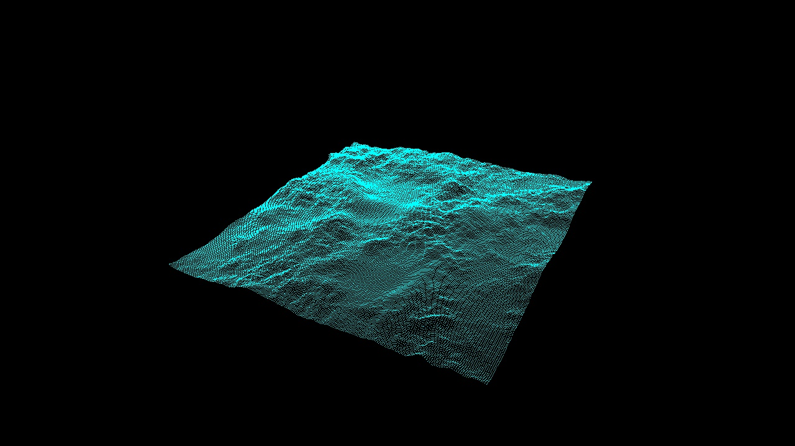

Height fields may be found in many applications of computer graphics. 
They are used to represent terrain in video games and simulations, and also often utilized to represent data in three dimensions. 
This project creates a height field based on the data from an image which the user specifies at the command line, 
and allows the user to manipulate the height field in three dimensions by rotating, translating, or scaling it. 
This project was implemented using OpenGL's core profile.

User key:
'x' to take screenshot
'p' for point mode
'w' for wireframe mode
's' for solid mode
'c' for wireframe on top of solid mode
'ctrl' + mouse movement to translate the rendering
'shift' + mouse movement to deform the rendering
left mouse key + mouse movement to rotate the rendering

Animation screenshots:
hw1-starterCode\animation
